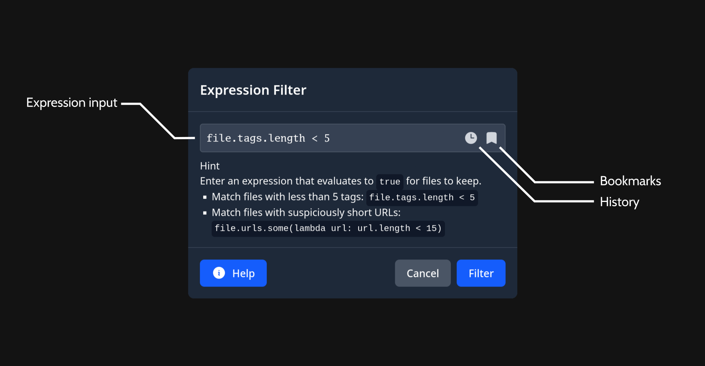
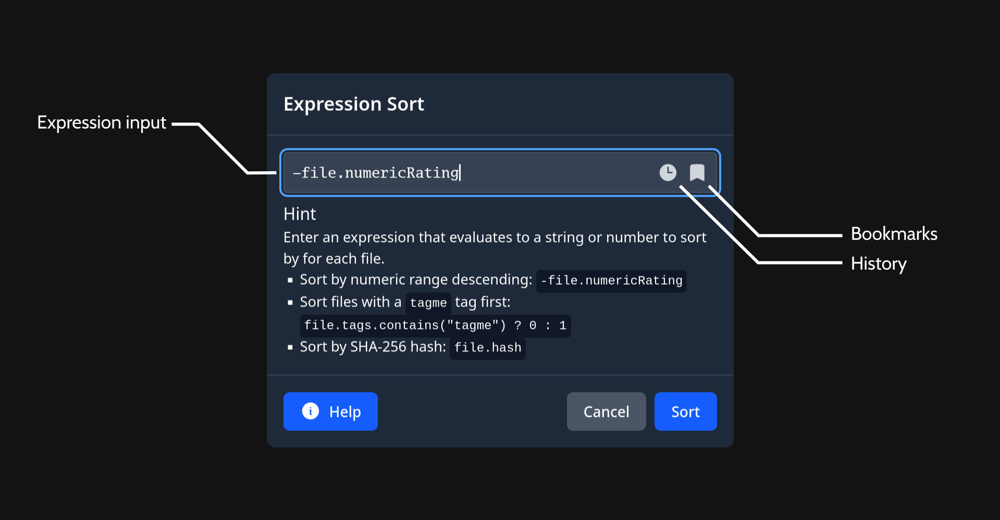

# Expressions

Hydrui has an integrated scripting language with a syntax similar (but not identical) to JavaScript. Currently, the only use case for this scripting language is to support client-side filtering and sorting of Hydrui page views.

## Filtering

Client-side filtering can be activated by opening the context menu inside of a page view (Utilities &rarr; Filter View with Expression...).



- The expression input is self-explanatory: you can enter the expression here.
- The last 100 filter expressions are saved in the history.
- You can bookmark useful filter expressions and give them names.

The variable `file` is available to access properties of the file. The filter expression is ran for each file in the page view. If it returns `true`, the file is kept. If it returns `false`, the file is removed from the view.

If you run the filter from a Hydrus Network page, the resulting filtered data will be copied to a new Hydrui virtual page, since Hydrui can not mutate the page in Hydrus Network.

## Sorting

Client-side sorting can be activated by opening the context menu inside of a page view (Utilities &rarr; Sort View with Expression...).



- As with the expression filter modal, you can enter an expression into the expression input.
- The last 100 sort expressions are saved in the history.
- You can bookmark useful sort expressions and give them names.

The variable `file` is available to access properties of the file. The sort expression is ran for each file in the page view. The sort expression should yield either a number or string for each file, which will then be used to sort the file accordingly.

If you run the sort operation from a Hydrus Network page, the resulting sorted data will be copied to a new Hydrui virtual page, since Hydrui can not mutate the page in Hydrus Network.

## Language

### Types

The expression subset of Hydrui's internal scripting language supports a typical set of primitive types:

- Numbers (e.g.: `0`)
- Booleans (e.g.: `true`/`false`)
- Strings (e.g.: `"Hello, world!"`)
- Null (e.g.: `null`)

In addition, the following composite types are representable in the language:

- Lists
- Hydrus files

### Unary Operators

The following unary operators are supported:

- Unary Plus (`+` &mdash; e.g.: `+1`)
- Negate (`-` &mdash; e.g.: `-1`)
- Logical Not (`!` &mdash; e.g.: `!false`)
- Bitwise Not (`^` &mdash; e.g.: `^0`)

### Binary Operators

The following binary operators are supported:

- **Logic**:
  - Logical Or (`||` &mdash; e.g.: `true || false`)
  - Logical And (`&&` &mdash; e.g.: `true && true`)
- **Comparison**:
  - Equal (`==` &mdash; e.g.: `true == true`)
  - Not Equal (`!=` &mdash; e.g.: `true != true`)
  - Lesser (`<` &mdash; e.g.: `0 < 1`)
  - Lesser Equal (`<=` &mdash; e.g.: `1 <= 1`)
  - Greater (`>`&mdash;e.g.: `1 > 0`)
  - Greater Equal (`>=` &mdash; e.g.: `1 >= 1`)
- **Arithmetic**:
  - Add (`+` &mdash; e.g.: `1 + 1`)
  - Sub (`-` &mdash; e.g.: `70 - 1`)
  - Mul (`*` &mdash; e.g.: `4 * 6`)
  - Div (`/` &mdash; e.g.: `10 / 2`)
  - Rem (`%` &mdash; e.g.: `2 % 1`)
- **Bitwise**:
  - Or (`|` &mdash; e.g.: `2 | 4`)
  - Xor (`^` &mdash; e.g.: `1 ^ 1`)
  - Lsh (`<<` &mdash; e.g.: `1 << 4`)
  - Rsh (`>>` &mdash; e.g.: `840 >> 2`)
  - Bitwise And (`&` &mdash; e.g. `1 & 1`)
  - Bitwise And Not (`&^` &mdash; e.g. `1 &^ 1`)
- Member (`.` &mdash; e.g.: `file.width`)
- Call (`()` &mdash; e.g.: `file.tags.contains("meta:animated")`)
- Subscript (`[]` &mdash; e.g.: `file.tags[0]`)
- Group (`,` &mdash; e.g.: `0, 1`)

Binary operators in the Hydrui script language follow Go precedence rules. These rules are similar to C, but alleviate some common footguns.

### Ternary Operator

The C-style ternary operator is supported. The ternary operator allows an expression to have an inline conditional and make a choice based on the result of that conditional. For example, if you wanted to write an expression that got either the width or height of a file, whichever is larger, you could express it like so:

```
file.width > file.height ? file.width : file.height
```
