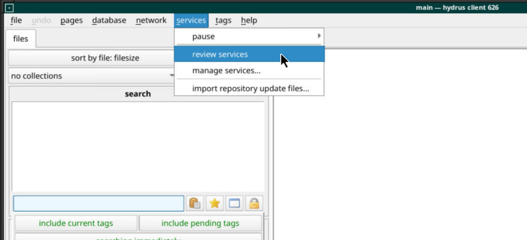
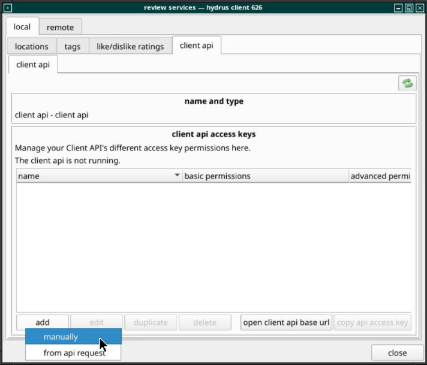
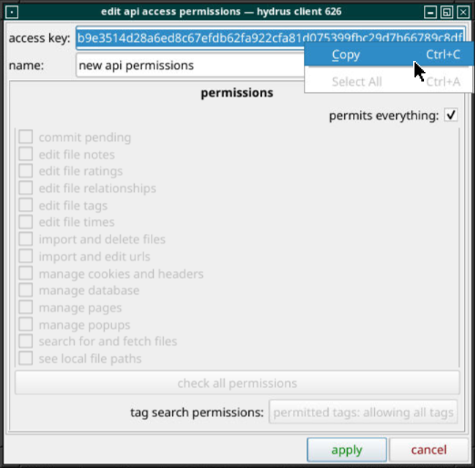
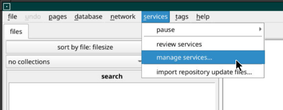
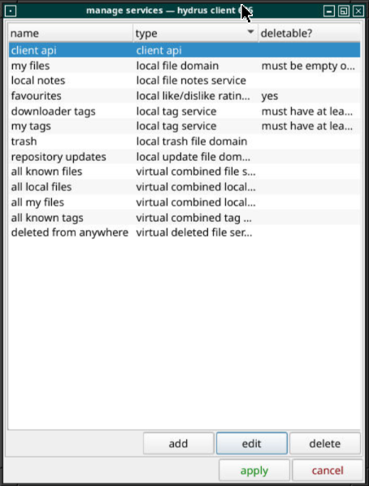
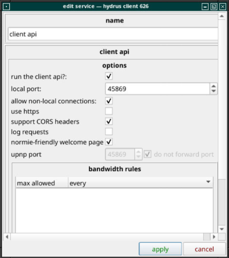
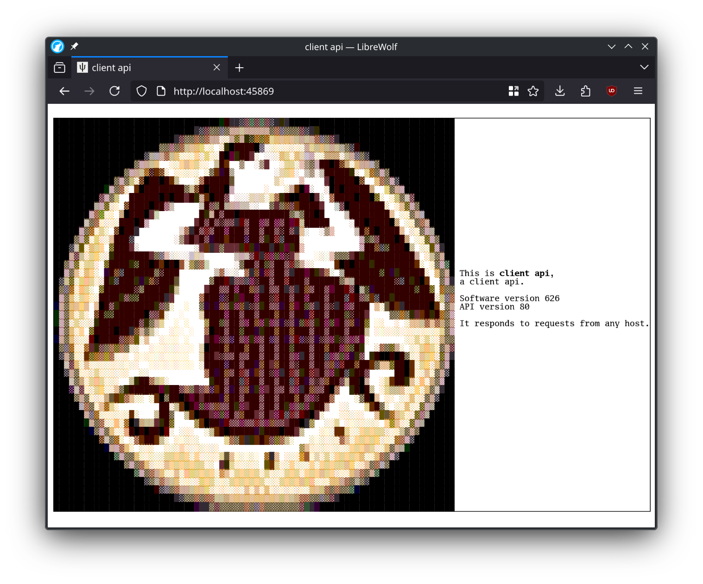

# Getting started

This guide assumes you are already running a hydrus client. If you aren't, check out the [Running hydrus network](../running-hydrus-network) page first.

## Overview

Here's what you will need to do to get Hydrui working with hydrus network:

- Create an API key in hydrus network
- Configure and enable the hydrus network client API
- Determine how to access the hydrus network client API from your browser
- **Bypass security warnings in your browser**
- Log into Hydrui using your API key

## Create API Key

Using the hydrus client UI, create an API key for Hydrui. To create an API key, first enter the review services window by going to the services → review services menu from the main menu bar.

Navigate to local → client api → client api in the tab hierarchy. Click the add button, then select &ldquo;manually&rdquo;.

You don't need to modify the default permissions unless you are concerned about granting Hydrui too much access, so you can keep the default "permits everything" options. You can copy the access key, then save it by clicking apply. **Make note of the access key, since you'll need it to log in.**

## Configure the Client API

You need to enable the client API service and ensure that the port it is opened on is accessible to your browser. Firstly, access the services → manage services menu from the main menu bar.

In the manage services window, either double click &ldquo;client api&rdquo;, or select it and then select the edit button.

Enable the service. Optionally, configure it as needed:

- Allow non-local connections, unless you are sure you don't need this.

- Enable CORS headers, if you are not self-hosting and using server-mode.

- **Enable use HTTPS**, if you are not self-hosting and using server-mode. This is not strictly necessary, but it usually makes life easier.

Then click &ldquo;apply&rdquo;.

## Accessing the Client API

Hydrui needs to be able to access your hydrus client API port using your web browser, so you need to find the correct URL to access the client API with.

- **If the hydrus client is running on the same machine**, usually you can access the port directly via localhost, i.e. <https://localhost:45869>

- **If the hydrus client is running on another machine in the same local network**, you may be able to access it via the machine's local network IP address. You may need to ensure that any firewalls on the local machine allow incoming traffic on the port.

- **If you want to access a hydrus client over the internet**, you may need a more complicated setup.
  - You can use port forwarding with a home router to expose a port on your home internet IP address, if your home internet has a dedicated port. You will need to find the administration interface for your router, which is generally accessible at a location like <http://192.168.1.1> or <http://192.168.0.1>.

  - You can use a VPN connection to bridge computers on different networks together so that they can access each other as if they are on a local network together. For example, you can use [Tailscale](https://tailscale.com/) on the machine running the hydrus client and the machine accessing Hydrui from a browser, or you can set up a Wireguard VPN yourself. If you're using Tailscale, you'll need to use the Tailscale IP or hostname to access your hydrus client API port.

- **If you run the Hydrui server in server mode**, you can expose Hydrui instead and keep hydrus client only accessible locally.

In any case, you will be able to verify if your API server is accessible by trying to navigate to it directly. Once you can access this page, you should be able to use Hydrui.

**Note:** If you use the wrong scheme (i.e. if you use `http://...` when use https is checked) you may receive a cryptic error. Try flipping between `http://...` and `https://...` if this happens.

You should be able to use <https://localhost:45869> as the client API URL. **Important: The hydrus network client API will be considered insecure by your browser, so please bypass the security warning when visiting the client API page before attempting to use Hydrui.** Hydrui can not bypass your browser's security functions and will silently fail if the API URL is considered insecure.

Now that you have found the URL to use to access your hydrus network client API and bypassed any security warnings, you can now log in.

## Log In

You need two pieces of information to be able to log in:

- Your client API URL, which you should have just determined.

- Your client API key, created in the first step.

With that, you can try to [log in](/client).

**Note**: Most of these steps only need to be performed once, but you will need to manually bypass any security warnings accessing your hydrus network client API in each web browser you use.

**Note**: It is possible to use a non-HTTPS client URL with Hydrui, but Firefox's HTTPS-only mode exceptions don't work properly with Hydrui, so if you are using a Firefox-based browser, you will need to globally disable HTTPS-only mode and disable mixed content blocks and redirects in `about:config`. In Chromium-based browsers like Google Chrome, you can use the page icon menu to go into Site Settings and allow &ldquo;Insecure Content&rdquo; to enable logging into a non-HTTPS client API. We are looking for solutions to simplify this in the future.

## Self-hosting

Using a hosted service like hydrui.dev always comes with risks. You can self-host Hydrui to mitigate some of those risks and avoid issues with mixed content or invalid HTTPS certificates. For more information about self-hosting, please check out the [self-hosting](../../self-hosting) section.
